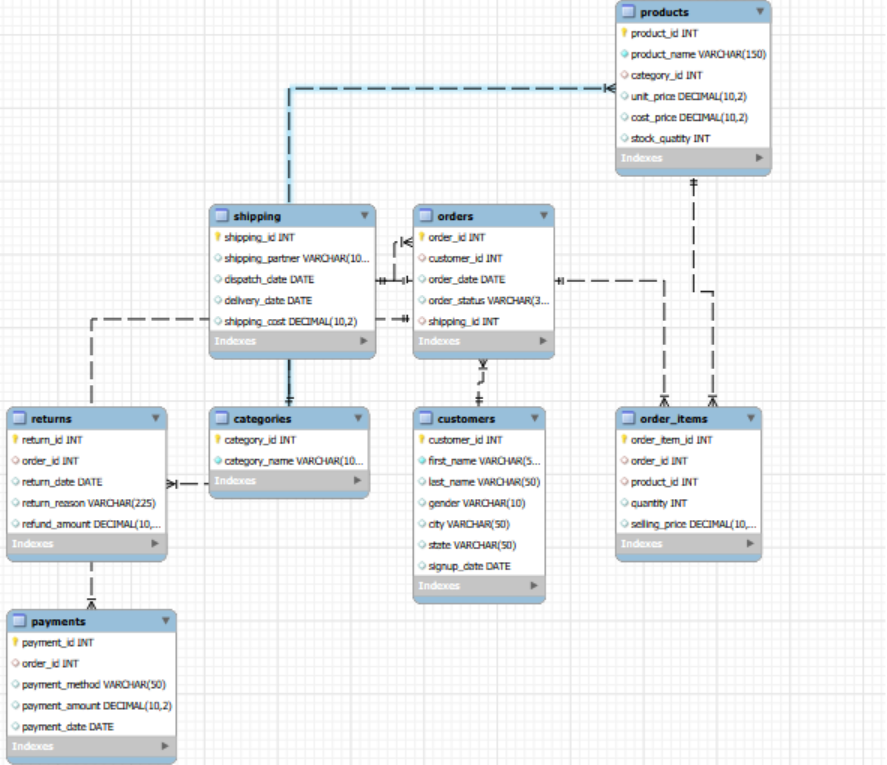
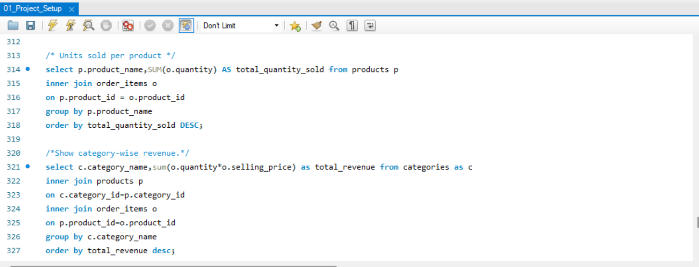

# Business Performance Analytics (SQL Portfolio Project)

## Project Overview

This project focuses on analyzing business performance using SQL by building a relational database from scratch and solving real-world business questions. The project simulates an e-commerce business environment involving customers, products, orders, payments, shipping, and returns.

The objective of this project was to strengthen SQL skills while applying analytical thinking to answer business-oriented questions.

---

## Business Problem

Businesses generate large amounts of operational data every day. This project demonstrates how SQL can be used to organize, manage, and analyze business data to derive meaningful insights and support data-driven decision-making.

---

## Database Structure

The project consists of 8 interconnected tables:

* Categories
* Customers
* Products
* Shipping
* Orders
* Order_Items
* Payments
* Returns

---

## Database Relationship Diagram

---

## Business Questions Solved

- How many customers do we have?
- How many products do we sell?
- How many orders were placed?
- How many payment methods do we have?
- Which cities do our customers belong to?
- Customers per city
- Orders by status
- Products per category
- Revenue by payment method
- Return reasons count
- Which city has the highest number of customers?
- Customer order history
- Product purchase details
- Units sold per product
- Category-wise revenue
- Total amount spent by each customer
- Top 5 customers by revenue
- Customer ranking

---

## Sample SQL Queries

---

## SQL Concepts Used

- SELECT
- Aggregate Functions (COUNT, SUM)
- DISTINCT
- GROUP BY
- ORDER BY
- LIMIT
- INNER JOIN
- Window Function (RANK)

---

## Tools Used

* MySQL
* MySQL Workbench
* GitHub

---

## Key Learnings

* Built a relational database from scratch.
* Established relationships between multiple tables.
* Performed business-oriented data analysis using SQL.
* Applied joins, aggregations, ranking functions, and analytical queries.
* Strengthened analytical and problem-solving skills by answering real-world business questions.
